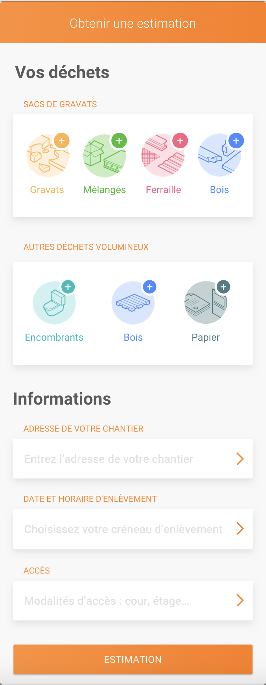
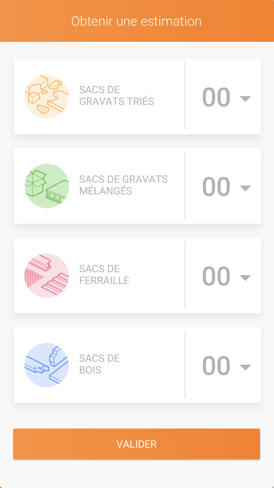

# Test React

## Exercice
Proposez une architecture qui puisse répondre au besoin de l'application dont les écrans sont affichés ci-après.
L'ordre est le suivant:

    1- Signin
    2- Formulaire 1 choix des types de déchets
    3- Formulaire 2 choix des quantités
    4- Page de checkout

Créez tous les fichiers qui vous sembles nécéssaires (exemple App.js). 
Inutile de coder, indiquez juste en commentaire:
 - Le but du module.
 - Les dépendances avec les autre modules en utilisant le mot clef ``import```.
 - Une liste des principales fonctions et leur but.

:warning:  L'architecture proposée est celle d'une application utilisant redux.
Libre à vous de la changer si vous ne trouvez aucun intéret à utiliser redux.

### Type d'Object à envoyer à l'api
```javascript
{
    gravats: 0,
    melanges: 0,
    ferraille : 0,
    bois: 0,
    encombrants: 0,
    bois: 0,
    papier: 0,
    infos: {
        addresse: "",
        enlevementDatetime: "", // format iso "2018-05-22T18:30:00Z"
        acces: ""
    }
}

```


## API Endpoints
Complétez ici la liste des endpoints de l'api nécéssaire au bon fonctionnement de l'application.
```
POST /signin
```


# Ecrans

<div align="center">
  
  
  
  
</div>